# Project Background 

This project analyzes the issue of layoffs by examining data from 2020 to 2023 to understand how and why workforce reductions are happening worldwide. By exploring trends across different countries, industries, and companies, the goal is to identify which sectors are most affected and the factors driving these changes. The insights gained will assist businesses and policymakers in making informed decisions in response to shifting economic conditions and workforce needs.

The code to perform the analysis can be accessed [here](/Layoffs_analysis.ipynb)

# Data Structure

The layoffs dataset provides insights into workforce reductions across various companies and industries. 

It includes essential attributes that detail the circumstances surrounding the layoffs, such as the affected country, industry, company name, and the scale of the layoffs. 

The dataset has undergone data cleaning processes to ensure accuracy and consistency.

# Executive Summary

### Overview of Findings

The phenomenon of layoffs has become a significant topic in the global economy, especially in recent years. This case study explores the trends in layoffs worldwide, focusing on the data from 2020 to 2023, highlighting the top countries, industries, and companies affected.

**Global Layoffs by Year**

From 2020 to 2023, the total number of layoffs globally exhibited a stark increase. Here’s a breakdown of the figures:

2020: 50,460 layoffs

2021: 5,485 layoffs

2022: 91,091 layoffs

2023: 125,637 layoffs

This data indicates a dramatic rise in layoffs, especially between 2022 and 2023, highlighting potential economic instability and workforce adjustments in response to market conditions.

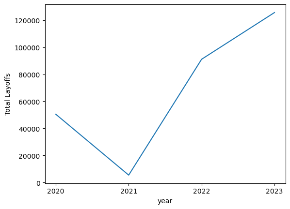

**Top Countries Affected**

The countries with the highest number of layoffs are:

**United States:** 177,786
**India:** 21,523
**Netherlands:** 13,220
**Sweden:** 10,364
**Brazil:** 8,309

The U.S. stands out significantly, accounting for a substantial portion of global layoffs, emphasizing its role as a key player in the global economy.

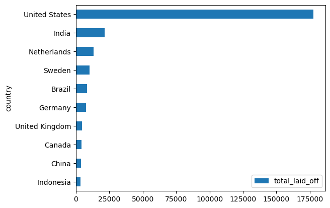

**Affected Industries**

The industries that experienced the most layoffs globally include:

**Consumer:** 35,477 layoffs
**Others:** 34,185 layoffs
**Finance:** 23,415 layoffs
**Retail:** 23,289 layoffs
**Healthcare:** 18,812 layoffs

These figures suggest that the consumer and retail sectors are particularly vulnerable, potentially due to shifts in consumer behavior and economic pressures.

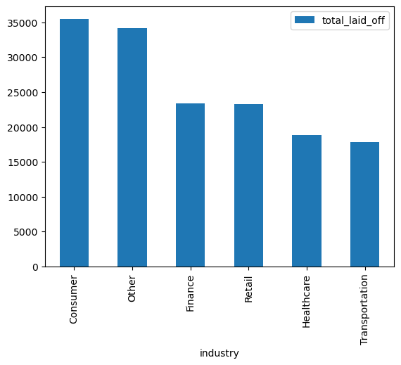

## U.S. Layoffs Breakdown

In the U.S., the top affected industries and their respective layoffs are as follows:

**Consumer:** 30,525
**Other:** 16,613
**Retail:** 15,165
**Finance:** 13,127
**Hardware:** 12,597
**Healthcare:** 10,408

The data indicates a broad impact across various sectors, with the consumer industry leading the layoffs.

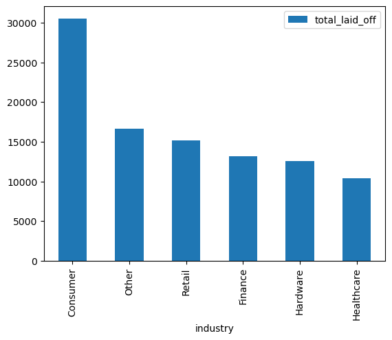

**Major Layoff Events in the U.S.**

Several prominent companies in the U.S. have contributed to the layoffs:

**Google:** 12,000 layoffs
**Meta:** 11,000 layoffs
**Microsoft:** 10,000 layoffs
**Amazon:** 8,000 layoffs
**Salesforce:** 8,000 layoffs

These layoffs reflect significant restructuring efforts and shifts in strategy by these tech giants in response to economic conditions.

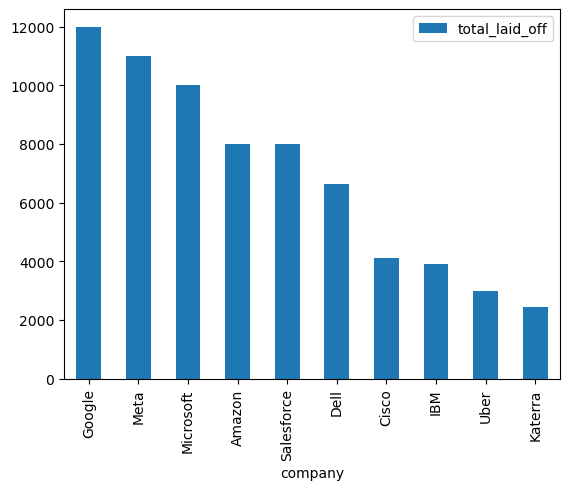

**Layoffs by Company Stage in the U.S.**

In the U.S., the stage of the companies significantly influences layoffs:

**Post-IPO:** 675 layoffs
**Series H:** 258 layoffs
**Series F:** 164 layoffs

This suggests that established companies (Post-IPO) are also facing challenges, leading to workforce reductions.

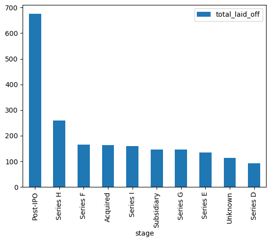

# India’s Layoff Landscape

In India, the layoffs were as follows:

**Education:** 3,760
**Finance:** 3,126
**Consumer:** 2,750
**Retail:** 2,469
**Travel:** 1,900

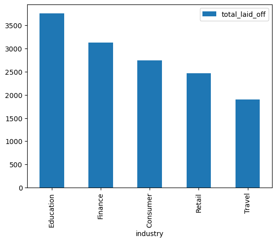

Top Companies in India:

**Bytedance:** 1,800 layoffs
**PaisaBazaar:** 1,500 layoffs
**Byju's:** 1,500 layoffs

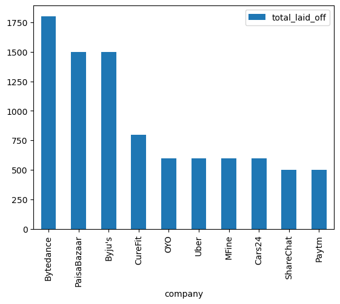

**Layoffs by Company Stage in India**

Similar to the U.S., the stage also matters in India:

**Series G:** 1,050 layoffs
**Private Equity:** 770 layoffs

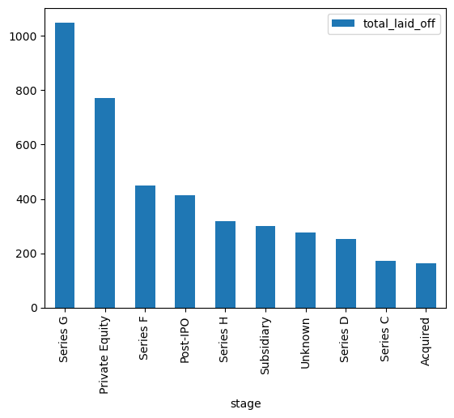

**Geographic Distribution of Layoffs**

In the U.S., significant layoffs were concentrated in urban areas:

**San Francisco Bay Area:** Over 80,000 layoffs
**Seattle:** Over 20,000 layoffs
**New York City:** More than 16,000 layoffs

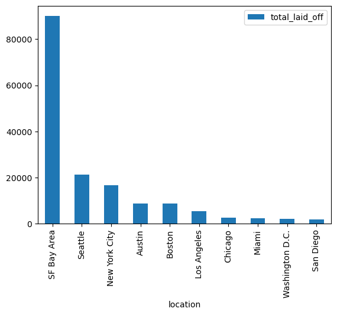

*In India, Bengaluru saw the highest layoffs:*

**Bengaluru:** More than 10,807 layoffs

**Gurugram:** 4,056 layoffs

**Mumbai:** 3,995 layoffs

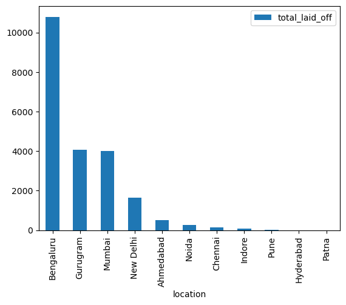

### Insights Deep Dive

**Increasing Layoffs:** The data from 2022 to 2023 indicates a concerning trend of rising layoffs, likely driven by economic uncertainty and corporate restructuring.

**Sector Vulnerability:** The consumer and retail sectors are particularly vulnerable, reflecting broader economic changes and consumer behavior shifts.

**Geographic Concentration:** Urban areas are the hardest hit, emphasizing the importance of regional economic conditions in layoff trends.

**Company Responses:** Major tech companies are leading layoffs, indicating a significant shift in the tech industry's landscape, likely influenced by market demands and operational efficiency goals.

**Global Context:** While the U.S. dominates the layoff statistics, other countries like India are also significantly impacted, particularly in specific sectors like education and finance.

# Recommendations:

Based on the findings, the following recommendations are made:

- Industries like tech, which are vulnerable to economic shifts, should diversify their talent pool to adapt to changes in market conditions.

- Governments and policymakers in India should focus on supporting metro cities like Bangalore and Mumbai, where layoffs are most concentrated.

- With layoffs concentrated in the tech sector, there should be increased emphasis on reskilling and upskilling employees to prepare them for new roles in emerging industries.

- Companies should establish improved tracking and forecasting systems to better anticipate market changes. This will help them prepare for potential downturns and lessen the impact of large layoffs.